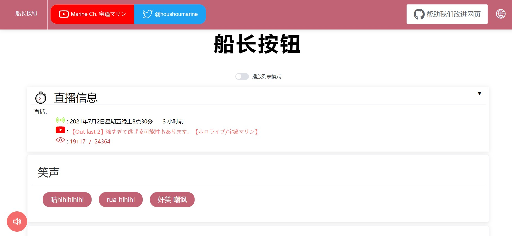
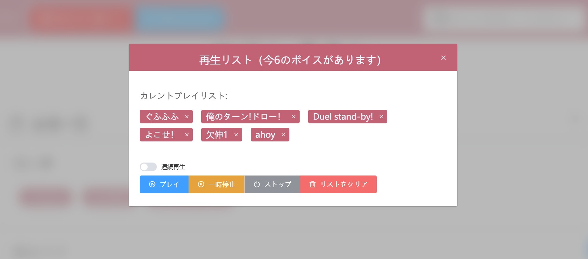

# ahoy_button

Voice buttons of virtual Youtuber Hosho Marin. Not support IE.

## Screenshots

main page:


playlist:


## Project setup
```
npm install

python3 -m venv ./venv
# Windows
# ./venv/Scripts/activate.bat

# Linux/Git Bash
source ./venv/bin/activate

pip install -r requirements.txt
```

### Compiles and hot-reloads for development
```
npm run serve
```

### Compiles and minifies for production
```
npm run build
```
